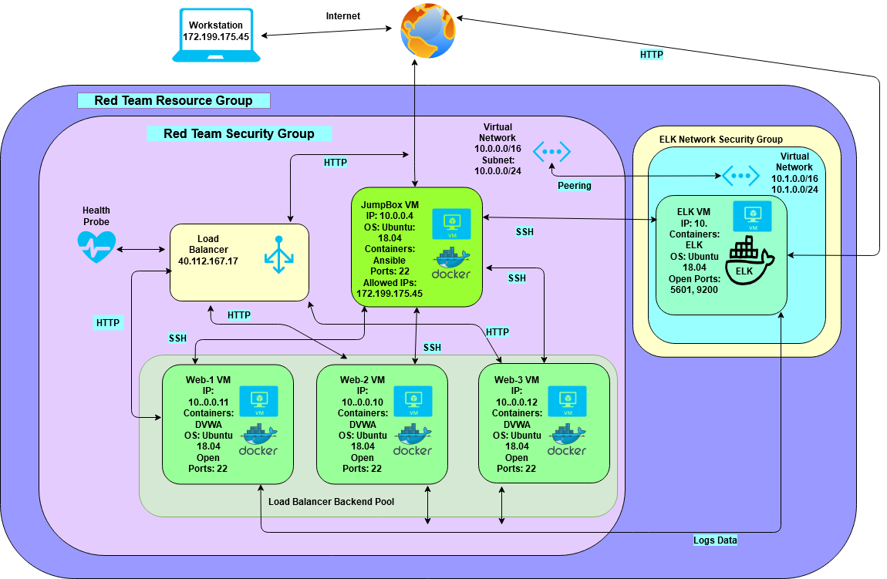
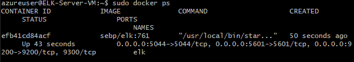

## Automated ELK Stack Deployment

The files in this repository were used to configure the network depicted below.

 

These files have been tested and used to generate a live ELK deployment on Azure. They can be used to either recreate the entire deployment pictured above. Alternatively, select portions of the playbook file may be used to install only certain pieces of it, such as Filebeat.

- 
- 
- 

This document contains the following details:
- Description of the Topology
- Access Policies
- ELK Configuration
  - Beats in Use
  - Machines Being Monitored
- How to Use the Ansible Build

### Description of the Topology

The main purpose of this network is to expose a load-balanced and monitored instance of DVWA, the D*mn Vulnerable Web Application.

Load balancing ensures that the application will be highly redundant, in addition to restricting access to the network.
-  A load balancer can help protect a netwroks availability. An advantage of a Jump Box is that it limits the access of the remote servers. 

Integrating an ELK server allows users to easily monitor the vulnerable VMs for changes to the File system and system metrics.
- Filebeat monitors the log files or locations that you specify, collects log events, and forwards them either to Elasticsearch or Logstash for indexing.
- MetricBeat helps you monitor your servers by collecting metrics from the system and services running on the server.

The configuration details of each machine may be found below.
_Note: Use the [Markdown Table Generator](http://www.tablesgenerator.com/markdown_tables) to add/remove values from the table_.

| Name     | Function   | IP Address | Operating System |
|----------|------------|------------|------------------|
| Jump-Box | Gateway    | 10.0.0.4   | Linux            |
| ELK      | SysMonitor | 10.1.0.4   | Linux            |
| Web-1    | Webserver  | 10.0.0.11  | Linux            |
| Web-2    | Webserver  | 10.0.0.10  | Linux            |
| Web-3    | Webserver  | 10.0.0.12  | Linux            |

### Access Policies

The machines on the internal network are not exposed to the public Internet. 

Only the Jump Box machine can accept connections from the Internet. Access to this machine is only allowed from the following IP addresses: Local Machine IPv4

Machines within the network can only be accessed by the Jump Box Ansible container.  They have a public key generated in the Ansible container as their key. My local machine also has been given access to the Elk machine's port 5601 to view Kibana. IP addresses: Local Machine IPv4

A summary of the access policies in place can be found in the table below.

| Name     | Publicly Accessible | Allowed IP Addresses |
|----------|---------------------|----------------------|
| Jump Box | Yes                 | Local Machine IPv4   |
| ELK      | No                  | 10.0.0.4             |
| Web-1    | No                  | 10.0.0.4             |
| Web-2    | No                  | 10.0.0.4             |
| Web-3    | No                  | 10.0.0.4             |

### Elk Configuration

Ansible was used to automate configuration of the ELK machine. No configuration was performed manually, which is advantageous because...
- _TODO: What is the main advantage of automating configuration with Ansible?_

This allows redundant installation across multiple servers that can be back ups of each other. We can be certain all of the servers have the same installation and we don't have to connect to each one separately to do so.

The playbook implements the following tasks: Install docker Install python3 Install Docker pip Download Docker image Enable Docker

The following screenshot displays the result of running `docker ps` after successfully configuring the ELK instance.

 

### Target Machines & Beats
This ELK server is configured to monitor the following machines: 10.0.0.10 10.0.0.11 10.0.0.12

We have installed the following Beats on these machines: FileBeat and MetricBeat.  

These Beats allow us to collect the following information from each machine:
 Filebeat collects the log files of servers it is monitoring. Metricbeat should be logging its upload of monitoring to Kibana. Metricbeat is collecting system metric data, like CPU resource usage and uptime. It's viewing the metrics of the docker containers on the servers.

### Using the Playbook
In order to use the playbook, you will need to have an Ansible control node already configured. Assuming you have such a control node provisioned: 

SSH into the control node and follow the steps below:
- Copy the playbook file to /etc/ansible/roles/.
- Install Filebeat and metric beat with curl commands
- Update the config file to include the private IP of the Elk server as well as the Elastic Search and Kibana host IP
- Update Hosts file located in /etc/ansible/hosts and include include the IPs of the machines you wish to install to. Specify where either elk or webservers respectively.
- Run the playbook, and navigate to to ElkMachinePublicIP:5601  to check that the installation worked as expected.